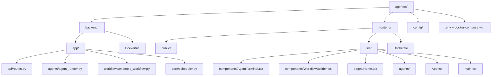

Here’s a clear **project map diagram** for the AgentOS Dashboard written entirely in Markdown using tree-style formatting.

You can paste this directly into your README or docs.

---

### 📦 **AgentOS Project Map**

```markdown
AgentOS/
├── backend/
│   ├── app/
│   │   ├── api/                  # FastAPI route handlers (REST endpoints)
│   │   │   └── routes.py
│   │   ├── agents/               # Agent execution logic
│   │   │   └── agent_runner.py
│   │   ├── workflows/            # Custom workflows driven by agents
│   │   │   └── example_workflow.py
│   │   └── core/                 # Shared tools (e.g., scheduler, utils)
│   │       └── scheduler.py
│   ├── Dockerfile                # Container for backend API
│   └── requirements.txt          # Python dependencies
│
├── frontend/
│   ├── public/                   # Static files
│   ├── src/
│   │   ├── components/           # Reusable UI elements
│   │   │   ├── AgentTerminal.tsx
│   │   │   └── WorkflowBuilder.tsx
│   │   ├── pages/                # Route-level views
│   │   │   └── Home.tsx
│   │   ├── agents/               # Frontend logic for agent control (planned)
│   │   ├── App.tsx               # Main app component
│   │   └── main.tsx              # Entry point
│   └── Dockerfile                # Frontend container
│
├── config/                       # Central configuration (LLM settings, tokens)
│
├── .env                          # Environment variables (e.g., OpenAI keys)
├── docker-compose.yml            # Multi-service orchestration
├── README.md                     # Project overview and usage
├── AgentOS_Implementation_Guide.md
├── README_FULL_AGENTOS.md
```

---

### 🔄 **Project Flow Diagram**

```text
[Frontend UI]
   ↓
[AgentTerminal / WorkflowBuilder]
   ↓ (HTTP)
[FastAPI Backend] -----> [Agent Runner]
           ↓                    ↓
       [Routes]          [OpenAI / Local LLM]
           ↓
     [Workflow Engine]
           ↓
    [Output / Report / Response]
```

Here’s a **Mermaid-compatible project map diagram** and **flow diagram** for the AgentOS Dashboard. You can embed these into your Markdown files (e.g. `README.md`, Notion, or Docusaurus) if the viewer supports Mermaid syntax.

---

### 📍 **AgentOS File Structure – Mermaid Diagram**

<details>
<summary>Click to expand Mermaid code</summary>



</details>

---

### 🔄 **AgentOS Execution Flow – Mermaid Diagram**

<details>
<summary>Click to expand Mermaid code</summary>

```mermaid
flowchart TD
  UI[Frontend UI (React)]
  AT[AgentTerminal.tsx]
  WB[WorkflowBuilder.tsx]
  API[FastAPI Backend]
  AR[Agent Runner (OpenAI/Ollama)]
  WF[Workflow Engine]
  RESP[Response to UI / Export]

  UI --> AT
  UI --> WB
  AT --> API
  WB --> API
  API --> AR
  API --> WF
  AR --> RESP
  WF --> RESP
```

</details>

---

### ✅ Embedding Tips

- In **Markdown** (like Docusaurus, Obsidian, or GitHub Pages), wrap diagrams in:
  ```markdown
  ```mermaid
  ...diagram code here...
  ```
  ```

- In **Notion**, use a Mermaid renderer (like https://mermaid.live or a Notion widget plugin).
